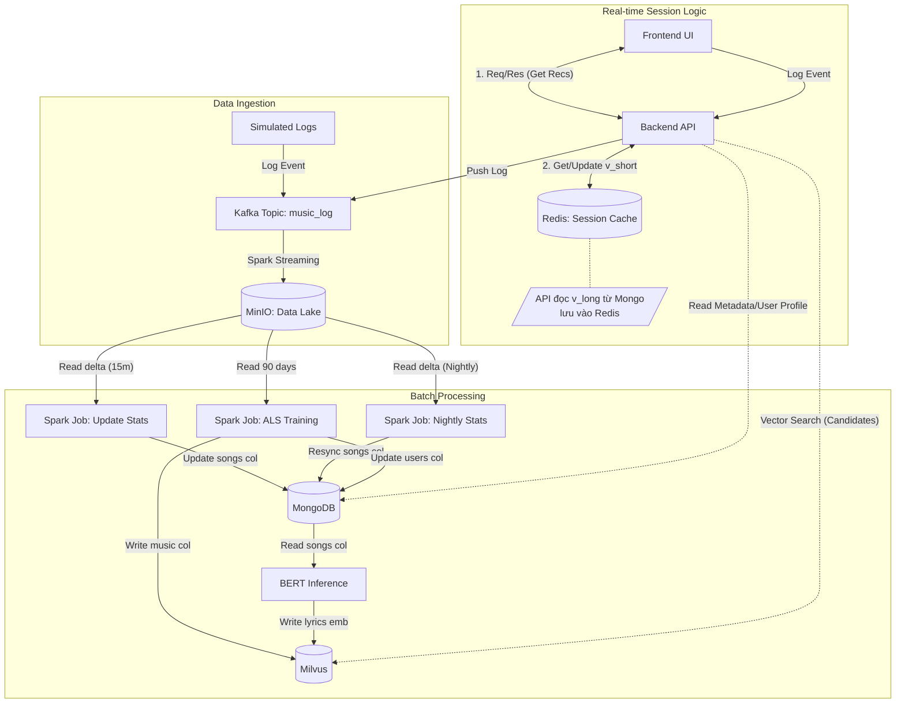

# 🎵 Real-time Music Recommendation System

> Hệ thống gợi ý âm nhạc thời gian thực sử dụng kiến trúc **Lambda Architecture**, kết hợp sức mạnh của **Collaborative Filtering (ALS)**, **Content-Based Filtering (BERT)** và **Session-based Recommendation**.


---

## 📖 System Overview (Tổng quan hệ thống)

Hệ thống được thiết kế để cung cấp trải nghiệm cá nhân hóa cho người dùng nghe nhạc, sử dụng các công nghệ Big Data để xử lý dữ liệu lớn. Hệ thống bao gồm hai tính năng cốt lõi:

1. **Home Page Recommendations:** Gợi ý danh sách bài hát phù hợp với "gu" của người dùng mỗi khi họ truy cập (Batch Processing).
2. **Next Song Prediction:** Tự động đề xuất bài hát tiếp theo dựa trên bài hát đang nghe (Real-time Context / Item-based Filtering).

---

## 📂 Project Structure (Cấu trúc dự án)

Tổ chức mã nguồn và dữ liệu được phân chia rõ ràng theo các tầng xử lý:

```text
music-recsys/
├── docker-compose.yml
├── .env
├── .gitignore
├── README.md
├── backend/
│   ├── api.Dockerfile
│   ├── requirements.txt
│   ├── config.py ---> Cấu hình sử dụng bên trong backend.
│   ├── scripts/
│   │   └── simulate_traffic.py ---> Code tạo giả lập hành vi người dùng.
│   └── app/
│       ├── main.py
│       ├── api/
│       │   ├── recommendation_api.py
│       │   ├── search_api.py
│       │   ├── user_api.py
│       │   └── logging_api.py
│       ├── core/
│       │   ├── kafka_client.py
│       │   └── database.py
│       └── services/
│           ├── logging_service_be.py
│           ├── user_service_be.py
│           ├── search_service_be.py
│           └── recommendation_service_be.py
├── common/
│   ├── schemas/
│   │   ├── log_schemas.py
│   │   ├── spark_schemas.py
│   │   └── milvus_schemas.py
│   └── logger.py ---> Phụ trách in log
├── data/                       
│   ├── raw/ ---> Dữ liệu thô (Logs)
│   ├── processed_sorted/ ---> Dữ liệu Parquet đã làm sạch (Input cho Model).
│   ├── songs_master_data/ ---> Dữ liệu bài hát.
│   ├── songs_master_data/ ---> Dữ liệu người dùng.
│   ├── simulation_logs/ ---> Chứa dữ liệu giả lập hành vi người dùng cuối dùng.
│   ├── lyrics_data/ ---> Chứa dữ liệu lời bài hát và dữ liệu vector nhúng lời bài hát.
│   └── checkpoints/ ---> Sử dụng lưu checkpoint Spark streaming (tùy chọn).
└── data_pipeline/                    
    ├── config.py
    ├── spark.Dockerfile
    ├── utils.py
    ├── requirements.txt
    ├── batch/            
    │   ├── resync_plays_7d.py --> Đồng bộ lượt nghe trong 7 ngày gần nhất trong dữ liệu bài hát từ log lưu trong Minio.
    │   ├── import_embedding_lyrics_collection.py ---> Nhập collection chứa vector nhúng lời bài hát vào Milvus.
    │   ├── import_users_master_data.py ---> Nhập dữ liệu người dùng vào MongoDB.
    │   └── import_songs_master_data.py ---> Nhập dữ liệu bài hát vào MongoDB.
    ├── ingestion/
    │   ├── incremental_update_listen_count.py ---> Đọc Minio, cập nhật lượt nghe bài hát mỗi 15 phút.
    │   └── stream_to_minio.py ---> Spark streaming đọc dữ liệu từ Kafka lưu vào Minio.
    ├── modeling/
    │   ├── create_lyrics_embeddings.py ---> Lấy vector nhúng lời bài hát ghi collection vào Milvus.
    │   └── train_als_batch.py ---> Huấn luyện mô hình ALS cập nhật vector người dùng và vector bài hát.
    ├── orchestration/
    │   └── manager.py ---> Quản lý các job spark, lên lịch đồng bộ dữ liệu và huấn luyện ALS.
    └── scripts/ ---> Các scripts xử lý dataset log hành vi lấy từ hugging face.
        ├── download_data.py
        ├── preprocess_sort.py
        ├── fix_format.py
        ├── ...
        └── fetch_lyrics_lrclib.py
```

## 🗄️ Database Schema Design

Hệ thống sử dụng mô hình lưu trữ lai (Polyglot Persistence): **MongoDB** cho dữ liệu định danh/metadata, **Milvus** cho dữ liệu Vector đặc trưng, và **Redis** cho dữ liệu phiên làm việc (Session).

### Phase 0. MinIO (Data Lake - Raw Logs)
> Lưu trữ nhật ký hành vi người dùng (User Logs) dưới dạng **Parquet**, phân vùng theo ngày.

* **Bucket:** `datalake`
* **Path:** `raw/logs/date=YYYY-MM-DD/part-*.parquet`

| Field | Type | Description |
| :--- | :--- | :--- |
| `user_id` | String | Khóa ngoại tham chiếu `users`. |
| `track_id` | String | Khóa ngoại tham chiếu `songs`. |
| `timestamp` | Long | Epoch Milliseconds. |
| `action` | String | `listen`, `skip`, `complete`. |
| `duration` | Integer | Thời gian đã nghe (giây). |
| `total_duration` | Integer | Tổng thời lượng bài hát (giây). |
| `source` | String | `simulation` hoặc `real_user`. |

### Phase 1. MongoDB (Metadata & User Profile)

#### Collection: `songs`
> Lưu trữ thông tin hiển thị (Metadata).

| Field | Type | Description |
| :--- | :--- | :--- |
| `_id` | String | **PK**. Track ID (UUID). |
| `track_name` | String | Tên bài hát. |
| `artist_id` | String | ID nghệ sĩ |
| `artist_name` | String | Tên nghệ sĩ. |
| `image_url` | String | Ảnh bìa bài hát. |
| `url` | String | Đường dẫn bài hát. |
| `duration` | Double | Thời lượng bài hát. |
| `plays_7d` | Int | Lượt nghe trong 7 ngày gần nhất (Trending). |
| `plays_cumulative` | Long | Tổng lượt nghe tích lũy. |
| `lrclib_plain_lyrics`| String | Lời bài hát (Raw text). |
| `lrclib_synced_lyrics` | String | Lời bài hát có thời gian. |
| `release_date` | Date | Ngày update. |

#### Collection: `users`
> Lưu trữ vector sở thích dài hạn (Long-term profile).

| Field | Type | Description |
| :--- | :--- | :--- |
| `_id` | String | **PK**. User ID. |
| `username` | String | Tên hiển thị. |
| `latent_vector` | Array `<Float>` | Vector ALS `[0.1, -0.5, ...]` (64 dims). |
| `signup_date` | Date | Ngày đăng kí. |
| `image_url` | String | Ảnh đại diện. |

### Phase 2. Milvus (Vector Database)

#### Collection 1: `music_collection` (Collaborative Filtering)
> Lưu trữ vector đặc trưng bài hát từ mô hình ALS.
* **Metric Type:** `IP` (Inner Product).
* **Dim:** 64 (latent factors).

#### Collection 2: `lyrics_embeddings` (Content-Based Filtering)
> Lưu trữ vector đặc trưng lời bài hát từ mô hình BERT.
* **Metric Type:** `IP` (Cosine Similarity).
* **Dim:** 384 (all-MiniLM-L6-v2).

---

## 🔄 Operational Workflow

Hệ thống hoạt động theo luồng khép kín từ thu thập dữ liệu (Streaming) đến huấn luyện (Batch) và phục vụ (Serving).

[Image of System Architecture Diagram]


### 🔹 Phase 1: Ingestion & Real-time Processing
1.  **Event Capture:** Frontend gọi API gửi log hành vi (`listen`, `skip`, `complete`) vào Backend.
2.  **Message Queue:** Backend đẩy log vào Kafka topic `music_log`.
3.  **Data Lake Sink:** Spark Streaming đọc dữ liệu từ Kafka và ghi xuống **MinIO** (Data Lake) dưới định dạng Parquet.
4.  **Near Real-time Stats:** Job Spark chạy định kỳ mỗi 5 phút, cập nhật tổng lượt nghe và lượt nghe trong 7 ngày cho bài hát trong MongoDB.

### 🔹 Phase 2: Batch Processing & Enrichment
1.  **Weekly Trending (Nightly):** Job Spark chạy mỗi đêm, tính toán tổng lượt nghe trong 7 ngày gần nhất (`plays_7d`) cập nhật vào MongoDB để phục vụ BXH Trending.
2.  **Content Embedding (One-time):**
    * Sử dụng mô hình BERT (`sentence-transformers`) trích xuất vector từ lời bài hát.
    * Lưu vào Milvus (`lyrics_embeddings`) phục vụ Content-based Filtering.

### 🔹 Phase 3: Model Training (Collaborative Filtering)
1.  **Training:** Job Spark chạy hàng đêm đọc lịch sử từ MinIO, huấn luyện mô hình ALS (Alternating Least Squares).
2.  **Vector Sync:**
    * **User Vectors:** Lưu vào MongoDB (`users`).
    * **Item Vectors:** Lưu vào Milvus (`music_collection`).

### 🔹 Phase 4: Serving & Recommendation Logic
Hệ thống sử dụng cơ chế **Session-based Hybrid Recommendation**.

#### 🧠 1. Session Vector Calculation
Hệ thống tổng hợp sở thích dài hạn (Long-term) và ngắn hạn (Short-term) theo công thức:

$$
\vec{V}_{session} = 0.7 \times \vec{V}_{long\_term} + 0.3 \times \vec{V}_{short\_term}
$$

* **Long-term ($\vec{V}_{long\_term}$):** Vector ALS của User từ MongoDB (cập nhật hàng đêm).
* **Short-term ($\vec{V}_{short\_term}$):** Vector phiên làm việc hiện tại, lưu trong **Redis**. Cập nhật real-time theo công thức **Exponential Moving Average**:
    $$
    \vec{V}_{short\_new} = 0.5 \times \vec{V}_{short\_old} + 0.5 \times \vec{V}_{current\_song}
    $$

#### 🏠 2. Scenario A: Home Page (Discovery)
* **Logic:** Collaborative Filtering thuần túy.
* **Process:** Dùng $\vec{V}_{session}$ tìm kiếm các bài hát tương đồng nhất trong **Milvus** (`music_collection`).

#### ⏭️ 3. Scenario B: Next Song (Hybrid Filtering)
* **Logic:** Kết hợp hành vi người dùng (ALS) và nội dung bài hát (Lyrics).
* **Scoring Formula:** Điểm số cuối cùng được tổng hợp từ hai nguồn đã được chuẩn hóa (Normalized):
    $$
    Score_{final} = 0.6 \times Norm(Score_{ALS}) + 0.4 \times Norm(Score_{Content})
    $$
* **Process:**
    1.  Tìm Candidate từ Milvus (ALS Vector).
    2.  Tìm Candidate từ Milvus (Lyrics Vector).
    3.  Trộn kết quả và xếp hạng lại (Re-ranking).

---

## 🧬 System Architecture Diagram



## ✅ Implementation Checklist (Tiến độ thực hiện)

Dưới đây là danh sách các hạng mục công việc cần hoàn thành để vận hành hệ thống.

### 1. 🏗️ Infrastructure (Hạ tầng)
> Mục tiêu: Dựng môi trường container ổn định cho Big Data & AI.

- [X] **Docker Compose Setup**
  - [X] Cấu hình Apache Spark (Master & Worker).
  - [X] Cấu hình Kafka KRAFT (Message Broker).
  - [X] Cấu hình MinIO (S3 Compatible Data Lake).
  - [X] Cấu hình MongoDB (NoSQL Database).
  - [X] Cấu hình Milvus (Vector Database) & Attu Dashboard.
  - [X] Cấu hình Redis (In-memory Cache cho Session).
- [X] **Networking:** Đảm bảo các container thông nhau (Bridge Network).
- [X] **Volume Persistence:** Mount volume cho DB để tránh mất dữ liệu khi restart.

### 2. 📥 Data Ingestion (Thu thập dữ liệu)
> Mục tiêu: Đưa dữ liệu hành vi người dùng vào Data Lake.

- [X] **Fake Data Producer**
  - [X] Script Python giả lập hành vi nghe nhạc.
  - [X] Đẩy message vào Kafka topic `music_log`.
- [X] **Streaming Pipeline**
  - [X] Spark Structured Streaming đọc từ Kafka.
  - [X] Sink dữ liệu xuống MinIO dưới dạng file `.parquet`.
  - [X] Partition dữ liệu theo ngày (`date=YYYY-MM-DD`).

### 3. 🧹 ETL & Master Data (Làm sạch & Metadata)
> Mục tiêu: Đồng bộ danh sách bài hát chuẩn và xử lý nội dung.

- [X] **Song Metadata Sync**
  - [X] Import dữ liệu bài hát/nghệ sĩ vào MongoDB collection `songs`.
  - [X] Đánh index tối ưu cho việc truy vấn.
- [X] **Content Enrichment**
  - [X] Fetch lời bài hát (Lyrics) từ API.
  - [X] **Embedding:** Dùng BERT trích xuất vector từ Lyrics.
  - [X] **Indexing:** Lưu vector vào Milvus (`lyrics_embeddings`).

### 4. 🧠 AI & Model Training (Batch Processing)
> Mục tiêu: Học thói quen người dùng & Sinh Vector đặc trưng.

- [X] **Training Job (Nightly)**
  - [X] Load dữ liệu Parquet 90 ngày gần nhất từ MinIO.
  - [X] Huấn luyện mô hình **ALS (Alternating Least Squares)**.
  - [X] **Export Users:** Lưu vector người dùng vào MongoDB (`users`).
  - [X] **Export Items:** Lưu vector bài hát vào Milvus (`music_collection`).
- [X] **Statistics Job**
  - [X] Tính toán lượt nghe 7 ngày gần nhất (`plays_7d`) để cập nhật Trending.

### 5. 🔌 Backend API (Serving Layer)
> Mục tiêu: API phục vụ Frontend & Tính toán Recommendation Logic.

- [X] **Core Logic**
  - [X] Kết nối đa luồng: Mongo, Milvus, Redis.
  - [X] **Session Vector:** Tính toán `0.7 * Long-term + 0.3 * Short-term`.
  - [X] **Short-term Memory:** Cập nhật Redis vector theo thời gian thực (EMA).
  - [X] **Hybrid Scoring:** `0.6 * ALS + 0.4 * Content`.
- [X] **API Endpoints**
  - [X] `GET /api/v1/recs/{user_id}`: Gợi ý trang chủ.
  - [X] `GET /api/v1/recs/{user_id}/{current_song_id}`: Gợi ý bài tiếp theo (Context-aware).
  - [X] `POST /api/v1/logs/event`: Nhận log từ Client.

### 6. 💻 Frontend (Web App)
> Mục tiêu: Giao diện người dùng cuối.

- [X] **Home Page:** Hiển thị danh sách gợi ý cá nhân hóa & Trending.
- [X] **Music Player:**
  - [X] Phát nhạc trực tiếp từ MongoDB.
  - [X] Tracking thời gian nghe thực tế.
  - [X] Gửi log update session khi nghe > 30s.
- [X] **Smart Queue:** Tự động fetch bài hát tiếp theo từ API khi playlist sắp hết.

---

## 🚀 Hướng dẫn chạy (Quick Start)

### 1. Khởi động Hạ tầng
Chạy toàn bộ hệ thống bằng Docker Compose:

```bash
docker compose up -d
```

### 2. Nạp dữ liệu master và dữ liệu vector từ lời bài hát(lần đầu chạy)
Trước khi hệ thống có thể hoạt động, cần nạp dữ liệu bài hát (Songs) và người dùng (Users) vào MongoDB.

```bash
docker compose run --rm job-sync-master
``` 

Vào giao diện Minio ở địa chỉ http://localhost:9001, nhập username và password bằng giá trị đã set trong tệp môi trường .env. Vào bucket liên kết Milvus và import file `embeddings_lyrics.parquet` từ thư mục `data/lyrics_data` vào. Sau đó chạy lệnh để nạp dữ liệu vector lời bài hát vào
`lyrics_embeddings` collection trong Milvus.
```bash
docker exec -it spark-master python3 /opt/src/batch/import_embedding_lyrics_collection.py
```

### 3. Kiểm tra trạng thái & Truy cập Dashboard
Đảm bảo các container đều ở trạng thái `Healthy` hoặc `Up` bằng lệnh `docker ps`. Sau đó truy cập các trang quản trị:

- Frontend Web App: http://localhost:5173
- Backend API Docs: http://localhost:8000/docs
- MinIO Console: http://localhost:9001
- Spark Master UI: http://localhost:9090
- Kafka UI: http://localhost:8080

### 4. Chạy giả lập dữ liệu (Simulate Traffic)
Chạy script giả lập để sinh log hành vi (listen, skip, complete) đẩy vào Kafka. Log giả lập này chỉ có hành vi complete, có thể sử dụng để huấn luyện ALS.
```bash
docker exec -it music-backend python3 /app/scripts/simulate_traffic.py --speed 200
```

### 5. Dừng hệ thống
Để tắt các container nhưng vẫn giữ lại dữ liệu (trong Volumes):
```bash
docker compose down
```
