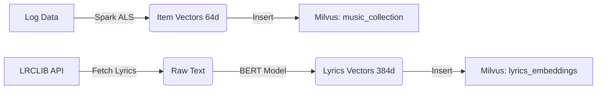

# 🧠 Hybrid Music Recommendation Logic
> Tài liệu kỹ thuật chi tiết về thuật toán và cơ chế gợi ý lai (Hybrid Engine).

---

## ⭐️ Tổng quan Kiến trúc (Search Architecture)

Hệ thống sử dụng mô hình **3 Tầng (3-Tier Architecture)** để tối ưu hóa gợi ý:

1.  **Tầng Dài hạn (Long-term):** Hiểu "Gu" cố định của người dùng (User Profile).
2.  **Tầng Ngắn hạn (Short-term):** Hiểu hành vi trong phiên nghe nhạc hiện tại (Session Context).
3.  **Tầng Nội dung (Content - Lyrics):** Hiểu ngữ nghĩa/tâm trạng bài hát tức thì (Instant Context).

---

## 1. Biểu diễn Dữ liệu (Vector Representation)

Hệ thống ánh xạ âm nhạc và người dùng vào 2 không gian vector riêng biệt:

### A. Không gian Hành vi (Behavior Space - Latent Space)
Được tạo ra bởi thuật toán **ALS (Alternating Least Squares)**.
-   **Đối tượng:** User, Song.
-   **Số chiều (Dimension):** 64.
-   **Ý nghĩa:** Hai vector gần nhau nghĩa là chúng thường xuất hiện cùng nhau trong hành vi lịch sử (Người thích A cũng thích B).
-   **Lưu trữ:** MongoDB (`users`), Milvus Collection `music_collection` (`songs`).

### B. Không gian Nội dung (Content Space - Semantic Space)
Được tạo ra bởi mô hình ngôn ngữ **BERT (Sentence-Transformers)**.
-   **Đối tượng:** Lyrics (Lời bài hát).
-   **Model:** `all-MiniLM-L6-v2`.
-   **Số chiều (Dimension):** 384.
-   **Ý nghĩa:** Hai vector gần nhau nghĩa là bài hát có nội dung, chủ đề hoặc tâm trạng tương tự nhau (Ví dụ: Cùng là nhạc buồn về mưa).
-   **Lưu trữ:** Milvus Collection `lyrics_embeddings`.

---

## 2. Công thức Toán học (Core Formulas)

### A. Implicit Feedback (Lượng hóa sự yêu thích)
Chúng ta không có nút "Like/Dislike", nên phải suy luận từ hành vi:

$$Rating(u, i) = w_1 \cdot \mathbb{I}(\text{finished}) - w_2 \cdot \mathbb{I}(\text{skipped}) + w_3 \cdot \log(1 + \text{duration})$$

*   Nếu User nghe hết bài -> Điểm cao.
*   Nếu Skip ngay -> Điểm âm.
*   Logarithm giúp chuẩn hóa thời gian nghe (nghe 10s khác 0s, nhưng 300s không quá khác 290s).

### B. Session Vector Update (Cập nhật sở thích ngắn hạn)
Khi User nghe một bài hát mới $v_{current}$, vector sở thích ngắn hạn (Session) được cập nhật theo trung bình trượt (Moving Average):

$$\vec{V}_{session}^{(t)} = \beta \cdot \vec{V}_{current} + (1 - \beta) \cdot \vec{V}_{session}^{(t-1)}$$

*   $\beta = 0.5$: Trọng số cập nhật. 50% là bài vừa nghe, 50% là lịch sử phiên trước đó.

### C. Target Vector Calculation (Vector Tìm kiếm)
Khi cần gợi ý, hệ thống tạo ra một "Vector mục tiêu" để tìm kiếm ứng viên:

$$\vec{V}_{target} = \gamma \cdot \vec{V}_{Long\_term} + (1 - \gamma) \cdot \vec{V}_{Session}$$

*   $\gamma = 0.3$: Chúng ta tin tưởng Session hiện tại (0.7) nhiều hơn sở thích cũ (0.3) khi đang trong luồng nghe nhạc.

---

## 3. Quy trình Gợi ý (Hybrid Scoring Flow)

Khi gợi ý bài hát tiếp theo, điểm số (Score) của một bài hát ứng viên $j$ được tính bằng tổng trọng số của 2 luồng:

$$Score(j) = \alpha \cdot \text{Sim}_{Behavior}(\vec{V}_{target}, \vec{V}_j) + (1 - \alpha) \cdot \text{Sim}_{Content}(\vec{E}_{current}, \vec{E}_j)$$

### Giải thích các tham số:
*   $\alpha = 0.6$: Hệ số cân bằng Hybrid.
*   **$\text{Sim}_{Behavior}$ (Collaborative Filtering):** Đo độ phù hợp dựa trên hành vi đám đông (Những người giống bạn cũng nghe bài này).
*   **$\text{Sim}_{Content}$ (Content-Based):** Đo độ phù hợp dựa trên nội dung bài hát (Bài này có lời giống bài bạn đang nghe).

---

## 4. Tại sao cần Lyrics? (Content-Based Role)

Chúng ta thêm **Lyrics Embeddings** vào Milvus để giải quyết 2 vấn đề mà ALS (Behavior) không làm được:

1.  **Vấn đề Cold-Start (Khởi động lạnh):**
    *   Một bài hát mới ra mắt chưa có ai nghe -> Không có vector ALS -> Không bao giờ được gợi ý.
    *   **Giải pháp:** Dùng Lyrics. Bài hát mới ra đã có lời. Hệ thống so sánh lời bài hát và thấy nó giống các bài Hit hiện tại -> Gợi ý ngay lập tức.

2.  **Vấn đề Ngữ cảnh (Context/Mood):**
    *   User đang buồn muốn nghe nhạc sầu não. ALS có thể gợi ý nhạc vui vì User thường nghe nhạc vui trong quá khứ.
    *   **Giải pháp:** Lyrics vector của bài đang nghe ("buồn") sẽ kéo các bài có lời "buồn" khác lên top gợi ý (Short-term Context).

---

## 5. Quy trình Đưa dữ liệu vào Milvus (Data Ingestion)

Hệ thống có 2 luồng dữ liệu riêng biệt đổ vào Milvus:

### Luồng 1: Behavior Vectors (Training Job)
*   **Nguồn:** `data_pipeline/modeling/train_als_model.py`
*   **Tần suất:** Batch (Hàng đêm).
*   **Quy trình:**
    1.  Spark đọc Logs từ Data Lake (MinIO).
    2.  Chạy thuật toán ALS để tính toán ma trận `UserFactors` và `ItemFactors`.
    3.  Lấy output `ItemFactors` (Vector 64 chiều).
    4.  Ghi đè vào Milvus Collection `music_collection`.
    5.  Build Index (IVF_FLAT) để tối ưu tìm kiếm.

### Luồng 2: Content Vectors (Enrichment Script)
*   **Nguồn:** `data_pipeline/scripts/create_lyrics_embeddings.py`
*   **Tần suất:** Ad-hoc (Khi có bài hát mới) hoặc Batch định kỳ.
*   **Quy trình:**
    1.  Lấy danh sách bài hát từ MongoDB.
    2.  Gọi API **LRCLIB** để lấy lời bài hát (Text).
    3.  Load model BERT (`sentence-transformers`) vào RAM.
    4.  Đưa Text qua Model -> Nhận về Vector 384 chiều (`embeddings`).
    5.  Insert/Upsert vào Milvus Collection `lyrics_embeddings`.

